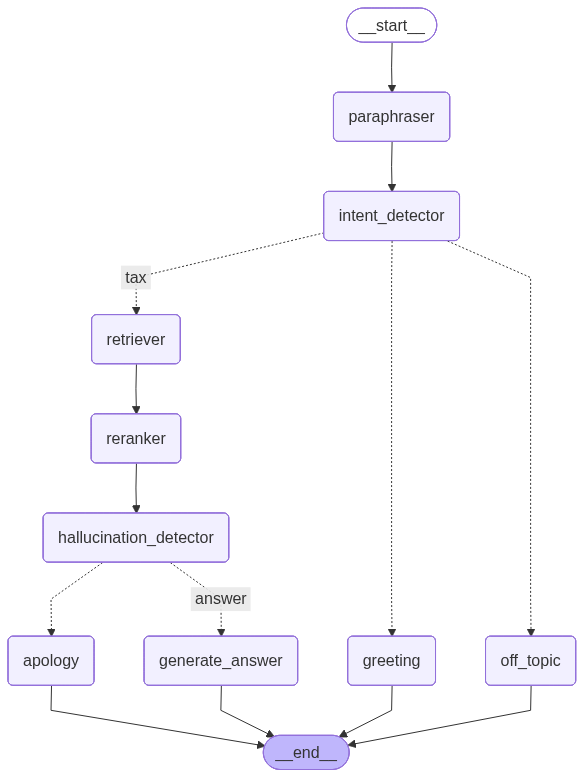

## 1. Project goal and original motivation

1. What concrete use case was the chatbot supposed to support? For example: answering citizen questions, helping fill forms, navigating administrative services, explaining legal/procedural requirements, etc.
    - The chatbot was designed as a RAG-based assistant for answering citizen questions. It supports users by retrieving relevant ELSTER help documentation and generating short, grounded answers about topics such as registration, certificates, user accounts, tax forms, deadlines. 
2. Who was the intended user? Citizens, government employees, researchers, demo audience, or someone else?
    - Mainly citizens.

3. Was the goal mainly a research prototype, a deployable system, a demo for EU SAI, or an evaluation benchmark?
    - The goal is to build an evaluation benchmark for comparing the Soofi model against other open-source LLMs such as Llama, Qwen, and Mistral.

4. What would count as 'success' for this project?
    - Success would mean having a reproducible benchmark where the Soofi model and other open-source models such as Llama, Qwen, and Mistral can be compared fairly on the sameRAG task. A successful system should retrieve relevant context, generate grounded answers, avoid unsupported claims, and produce measurable evaluation results across the test datasets.


5. Were there any explicit requirements from the EU SAI WP5 work package that this project was meant to satisfy?
    - I don’t know about that, better to ask Simon or Huyen.
## 2. Data and knowledge sources

7. What documents, websites, databases, or other sources does the chatbot use?

    - The chatbot uses ELSTER help documentation as its knowledge source.
    - Website source: https://www.elster.de/eportal/helpGlobal

8. Where are these data sources stored?
    - Local processed files
        - data/chunks.json
        - data/chunksnew.json
    - Vector database:
        - Qdrant
        - default collection: `elster_help`

9. Are the sources scraped, manually downloaded, generated, or provided by a partner?
    -  scraped public ELSTER help pages.
10. What language are the documents in? Only German, or mixed German/English?
    - The current indexed chunks are mainly German, but the project is intended to also include English. 
    - Evaluation:
        - German and English
11. What type of administrative domain is covered? For example: residence permits, registration, social benefits, taxes, university administration, etc.

    - Domain: German tax administration
    - Portal: ELSTER / Mein ELSTER
    - Topics include:
        - registration
        - user account management
        - certificates / login
        - electronic tax forms
        - employee tax topics
        - employer topics such as ELStAM/LStB
        - powers of attorney
        - portal help and procedural guidance
12. Is the current dataset complete, or was it only a small proof-of-concept dataset?
    - The dataset is not complete for the entire ELSTER portal. It collects all topics from the ELSTER help pages that were targeted, but it currently excludes the “Formulare & Leistungen” section.
    - Current German chunk files:
        - 329 chunks
    - English chunks still need to be collected/chunked/ingested.

13. Are there any licensing, privacy, or usage restrictions on the data?
    - I don't know, but the data come from public ELSTER help pages, so there is no obvious personal or private data in the current chunks.

14. Is there any preprocessing pipeline? For example: PDF parsing, HTML cleaning, chunking, metadata extraction, deduplication.

    - Yes. The project has a preprocessing pipeline that crawls ELSTER help pages, saves them as Markdown/JSONL, cleans boilerplate text, splits the Markdown by headings, applies size-based chunking, adds hierarchical context metadata, deduplicates repeated content, and exports the final chunks as JSON for Qdrant ingestion

    - **Pipeline:**
        - Crawling: cli/crawlai.py uses crawl4ai to crawl ELSTER help pages.
        - Cleaning: removes ELSTER boilerplate such as search/loading/navigation text.
        - Chunking:
            - Markdown heading splitting
            - then recursive character splitting
            - max chunk size: 1200 characters
            - overlap: 250 characters


15. What metadata is stored with each document or chunk? For example: source URL, title, date, administrative region, document type, paragraph ID.
    - Metadata extraction:
        - `source`: original Markdown/source file, e.g. benutzerkonto.md
        - `section`: top-level help section
        - `subsection`: subsection heading
        - `topic`: topic heading
        - `question`: FAQ question, when available
        - `context_path`: full breadcrumb path
        - `chunk_id`: stable unique ID for the chunk
        - `part_index`: index if the content was split into multiple parts
        - `total_parts`: total number of parts for that item
        - `prev_id`: previous chunk ID for multi-part content, if applicable
        - `next_id`: next chunk ID for multi-part content, if applicable
        - `also_at`: alternative source locations for deduplicated repeated content, if applicable

## 3. RAG pipeline

16. What is the full RAG pipeline from user question to final answer?
User question
    ```
    -> paraphraser / language detector
    -> intent detector
    -> Qdrant hybrid retrieval
    -> CrossEncoder reranking
    -> context sufficiency check
    -> grounded LLM answer or safe fallback
    ```
17. How are documents chunked?
    - Documents are chunked from Markdown using a two-step process. First, the text is split by Markdown headings to preserve the ELSTER help hierarchy. Then oversized sections are split with a recursive character splitter using a maximum chunk size of 1200 characters and 250 characters overlap. Each chunk receives a context prefix and metadata so it remains understandable when retrieved alone.
18. What embedding model is used?
    - Dense embedding model:
        - `Qwen/Qwen3-Embedding-8B`
    - Sparse embedding model:
        - `Qdrant/bm25`
19. What vector database or search backend is used?
    - Vector database: `Qdrant`
20. Is retrieval based on dense embeddings, BM25, hybrid search, or something else?
    - Flowise: only dense embedding
    - python code support:
        - Hybrid
        - dense-only
        - sparse-only
21. How many chunks are retrieved initially?
    - Default in code `top_k = 5`
22. Are retrieved chunks filtered before being sent to the LLM?
    - Yes, retrieved chunks are filtered/ranked before being sent to the answer-generation LLM. The retriever first returns the top RAG_TOP_K chunks from Qdrant. These are then passed through a CrossEncoder reranker, and only the top-ranked chunks, usually the top 3, are formatted as context for the LLM. There is also a context-sufficiency check before answer generation.
23. Is there a reranker? If yes, which reranker and why was it added?
    - Python code: The project uses a CrossEncoder reranker, configured by default as `jinaai/jina-reranker-v3`
    - Flowise: used LLM as judge to rerank the context and only select 3. 
24. What problem was the reranker supposed to solve?
    - Initial retriever can return chunks that are related to the query but not necessarily the best evidence for answering it, so reranking helps choose the most directly relevant chunks before sending context to the LLM, which can help:
        - Reduces noisy context passed to the LLM.
        - Supports more grounded answers and fewer hallucinations.
        - Especially useful when many chunks contain similar terms like registration, certificate, account, form, or tax declaration.

25. Were there observed retrieval failures that motivated the current design?
    - Yes, the current design was motivated by practical retrieval and answer-quality issues. The system needed to answer in the same language as the user, avoid responding to irrelevant or off-topic questions, and reduce the amount of context sent to the LLM. The reranker helps select only the most relevant chunks from the initially retrieved results, which reduces noisy context and improves answer grounding.
26. Are citations or source links shown to the user?
    - The retrieved context includes internal source metadata such as source and context_path, and the context is formatted with labels like Quelle 1, Quelle 2, etc. However, the final answer prompt does not explicitly require the model to show citations or source links to the user.


27. Does the chatbot distinguish between 'I found support for this answer' and 'I am guessing'?
    - Yes, partially. The workflow includes a context-sufficiency or hallucination-detection step before answer generation.
## 4. LLM and prompting

29. Which LLM is currently used?
    - Models can be swapped for benchmarking:
        - Llama
        - Qwen
        - Mistral
        - In futur: Soofi
30. Is the model local, API-based, open-source, or proprietary?
    - API-based (Openrouter)
31. What prompts are used?

    The project uses separate prompts for each workflow step: query rewriting/language detection, intent routing,  context sufficiency checking, grounded answer generation, fallback responses, greetings, and off-topic handling. The most important answer-generation prompt instructs the model to use only the retrieved context, avoid external memory, refuse unsupported facts, answer in the detected language, and keep the answer concise.
32. Is there a system prompt defining behavior, safety, language, or citation requirements?

    Yes. 

33. Does the chatbot always answer in German?

    No. The chatbot is designed to answer in the detected language of the user question. 
34. Does the prompt instruct the model to refuse unsupported answers?

    Yes. The answer-generation prompt explicitly tells the model to use only the retrieved context and never use external memory.
35. Were different models tested?

    Yes, multiple models are part of the benchmark goal.
    - Target comparison:
        - Soofi
        - Llama
        -  Qwen
        - Mistral

36. Why was the current model chosen?
    
    The model setup was chosen to test whether the Soofi model can outperform other open-source models on german data.

37. Are there known problems with the model, such as hallucination, weak German, poor instruction following, or high latency?
    - Not yet
## 5. Flow, agents, and orchestration

39. You mentioned 'flow'? What exactly does this term mean in the current project?

    (Work)-Flow” = the end-to-end workflow/pipeline.

40. Is there an agent framework being used, such as LangChain, LangGraph, LlamaIndex, Flowise, Haystack, AutoGen, or something else?
    - Flowise and LangChain.
41. What are the steps in the current flow?

    The current flow starts by rewriting the user question and detecting its language, then classifies the intent. ELSTER/tax questions go through retrieval, reranking, context-sufficiency checking, and grounded answer generation. Greetings and off-topic questions are routed to separate response nodes.

42. Are there multiple agents, or is it just a structured pipeline?

    No until the project does not use multiple independent agents, but in futur we maybe use it, to reduce the hallucination, and handle complex question.

43. If there are multiple agents, what does each agent do?

    - N/A
44. Are tools being called by the model? For example: retrieval, web search, form lookup, calculator, database query.

    NO, in flowsie we used web search (Tavily), but we removed it. I current python code there are also no call tools.

45. Are agents actually necessary for the use case, or were they being explored experimentally?

    Agents are not strictly necessary for the basic ELSTER question-answering use case, because a structured RAG pipeline can already handle retrieval and answer generation. However, agent-like workflow steps can be useful for reducing hallucination, checking whether the retrieved context is sufficient, and handling more complex questions through rewriting or decomposition.

46. What parts of the system are stable, and what parts are experimental?
    - The stable parts are the core RAG pipeline structure, Qdrant-based retrieval, chunk preprocessing, configurable LLM provider, and evaluation scripts.
    - The experimental parts are model comparison with Soofi versus other open-source models, prompt tuning, reranker choices, hallucination detection.

## 6. Evaluation

47. What evaluation setup currently exists?
    
    The project includes an evaluation setup for both the local LangGraph RAG workflow and an external Flowise-style API. It uses German and English evaluation datasets with reference answers, then scores generated answers using lexical metrics, semantic similarity, and LLM-as-judge evaluation. The main benchmark goal is to compare Soofi against models such as Llama, Qwen, and Mistral on German ELSTER data.

48. Is there a test set of questions?
    
    The repository contains evaluation/test datasets with ELSTER questions and ground-truth answers. There is one German dataset and one English dataset, stored under `app/evaluation/`.
49. If yes, where is it stored and how was it created?
    - Stored at:
        - `app/evaluation/dataset-de.json`
        - `app/evaluation/dataset-en.json`
50. Are there reference answers?
    - Field name: `ground_truth`
    - Fields include:
        - `question`
        - `ground_truth`
        - `category`
        - `language`
51. What metrics are used? For example: retrieval recall, answer correctness, faithfulness, citation accuracy, helpfulness, latency.

    - Metrics:
        - BLEU
        - ROUGE-1 / ROUGE-2 / ROUGE-L
        - BERTScore
        - LLM-as-judge: 
            - correctness
            - completeness
            - relevance

52. Are evaluations automatic, human-judged, LLM-as-judge, or mixed?
    - LLM-as-judge
53. What were the latest evaluation results?

    - `app/evaluation/results`
54. What are the biggest failure cases?
    
    Weaker English performance due to incomplete English knowledge base.
55. Are there example queries where the system works well?
    
    Yes. The system works well on direct ELSTER help questions where the answer is clearly present in the indexed German help documentation,
    - Example queries:
        - `Was mache ich, wenn die angezeigten Bescheinigungen fehlerhaft oder unvollständig sind?`
        - `Gibt es noch Steuererklärungsformulare zum Download oder zum Ausdrucken?`

56. Are there example queries where the system fails badly?
    
    Yes, but mainly in specific edge cases rather than broad system failures. In the latest German result, the clearest bad example was an ElsterAuthenticator password-change question where the answer gave an incorrect or inconsistent password length. English evaluation also showed several weak categories, probably because English source chunks are not fully collected and ingested yet.
    - Example queries:
        - `Was muss ich bei einer Passwort-Änderung beachten?`
            - Issue: the generated answer gave an incorrect/inconsistent password length.
        - `Wann sollte ich eine Registrierung "Für eine Organisation" durchführen?`
            - Issue: missed an important warning note.
        - `Was muss ich tun, wenn mein Zertifikat bald abläuft?`
            - Issue: missed the warning that login/renewal is no longer possible after expiry.


57. Was the purpose of evaluation to compare RAG variants, compare models, or validate the full chatbot?

    - Compare models.

## 7. Current implementation

58. Where is the code repository?
    
    Github: https://github.com/Qassim99/elster-rag

59. What branch or folder contains the latest working version?
    - v2
60. How do I run the system locally?
    clone the project:
    ```bash
    git clone https://github.com/Qassim99/elster-rag.git
    ```
    ```bash
    python -m venv venv
    source venv/bin/activate
    pip install -r requirements.txt
    cp .env.example .env
    ```

    Then fill in `.env`

    ```bash
    OPENROUTER_API_KEY=...
    LLM_BASE_URL=https://openrouter.ai/api/v1
    LLM_MODEL=...
    QDRANT_URL=http://localhost:6333
    QDRANT_COLLECTION=elster_help

    ```
    Start Qdrant locally, for example:

    ```bash
    docker run -p 6333:6333 qdrant/qdrant
    ```
    Run workflow evaluation:

    ```bash
    python -m app.evaluation.eval_workflow --dataset app/evaluation/dataset-de.json
    ```
    Run test:

    ```bash
    python test.py
    ```
    Notes:

        - Requires an OpenRouter/API-compatible LLM key.
        - Requires Qdrant to be running.
        - The default collection is elster_help.


61. What dependencies or environment variables are needed?
    ```bash
    QDRANT_URL=http://localhost:6333
    QDRANT_API_KEY=
    QDRANT_COLLECTION=elster_help

    OPENROUTER_API_KEY=...
    LLM_BASE_URL=https://openrouter.ai/api/v1
    LLM_MODEL=...
    LLM_EVALUATOR_MODEL=...

    DENSE_LOCAL_EMBEDDING_MODEL=sentence-transformers/paraphrase-multilingual-MiniLM-L12-v2
    DENSE_EMBEDDING_MODEL=Qwen/Qwen3-Embedding-8B
    SPARSE_MODEL_NAME=Qdrant/bm25
    RERANKER_MODEL=jinaai/jina-reranker-v3

    RAG_TOP_K=5
    RETRIEVAL_API_PORT=8100

    ```

62. Are there API keys, model endpoints, or server credentials needed?

    - Required for LLM calls:
        - OPENROUTER_API_KEY
        - LLM_BASE_URL
        - LLM_MODEL
63. Is there a frontend?
    - python code: not yet.
    - Flowise : yes.
64. Is there a backend API?
    - Not yet
65. Is there a Docker setup or deployment script?
    - Flowise: yes
    - python code: not yet.
66. Is there a README or documentation?
    - yes
67. Are there any known bugs or broken components?
    - N/A

## 8. Design decisions and rationale

71. What were the main design decisions made so far?

72. Why was this particular RAG setup chosen?
    - Making the model comparison fair, grounded, and reproducible.
73. Why was the current reranker chosen?
    - Improving the relevance of retrieved ELSTER chunks before they are passed to the LLM.
74. Why was the current LLM chosen?
    - support model benchmarking,
75. Why was the current agent or flow framework chosen?
    - LangGraph was chosen because the project needs a controlled, reproducible workflow with conditional routing,
76. Were there alternatives that were tried and rejected?
    -  Vector database: 
        - Pinecone was considered but rejected because it is closed-source.
        - Qdrant chosen instead
    - Tool calling:
        - Tavily because web search change over time.
        - hard to reproduce result
        - hard to compare models fairly
77. Were there any discussions with the Huyen about the intended direction?
    - Soofi vs. Llama/Qwen/Mistral comparison
    - reproducible evaluation setup

## 9. Open problems and next steps

79. What were you planning to do next before the handover?
    - Improve chatbot
    - connect python code with flowise embedded chatbot
    - handle complex question

80. What is currently the highest-priority unfinished task?
    - Improve chatbot quality and fix bugs
81. What is the biggest technical bottleneck?
    - Python workflow ↔ Flowise embedded chatbot integration

## 10. Minimal reproduction and examples

88. Could you provide one minimal working example of the system?
    Yes. A minimal working example is available in example.py. It loads environment variables, initializes the LLM provider, connects to Qdrant, builds the LangGraph RAG workflow, asks a sample German ELSTER question, and prints the generated answer.

    Run it with:
    ```bash
    source venv/bin/activate
    python example.py
    ```
    Minimal example:

    ```python
    from dotenv import load_dotenv

    from app.core.config import Settings
    from app.infrastructure.llm_provider import LLMProvider
    from app.infrastructure.vector_store import QdrantRepository
    from app.services.workflow import RAGWorkflowEngine

    load_dotenv()

    settings = Settings()
    llm_provider = LLMProvider(settings, model="qwen/qwen3-32b")

    qdrant_repo = QdrantRepository(settings, mode="docker")
    qdrant_repo.initialize_for_retrieval()

    rag_engine = RAGWorkflowEngine(qdrant_repo, llm_provider, settings)

    response = rag_engine.execute("Wie kann ich mein Benutzerkonto löschen?", [])
    print(response)
    ```
89. Could you provide 5 example user questions and the expected behavior?

90. Could you include screenshots or logs of the current frontend/output if available?
- NA
91. Could you include a short diagram of the pipeline?

- Yes. The current pipeline can be summarized as:

```text
User question
    |
    v
Paraphraser + language detector
    |
    v
Intent detector
    |
    +--> Greeting/capability response
    |
    +--> Off-topic refusal
    |
    v
Qdrant hybrid retrieval
(dense embeddings + BM25 sparse retrieval)
    |
    v
CrossEncoder reranker
    |
    v
Context sufficiency / hallucination check
    |
    +--> Insufficient context: fallback answer
    |
    v
Grounded LLM answer
    |
    v
Final chatbot response
```

Generated workflow graph:



Thanks a lot! Short bullet-point answers are completely fine. If a question is not yet applicable or if you dont know it or if it is not relevant just say NA or 'don't know' or 'not yet implemented'.
